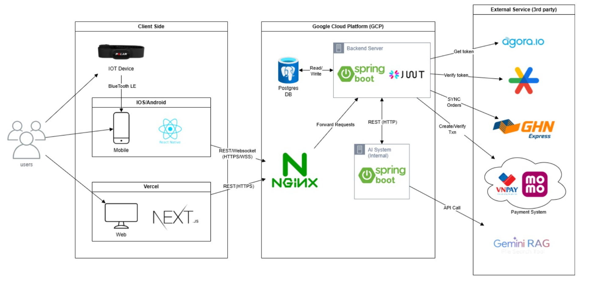
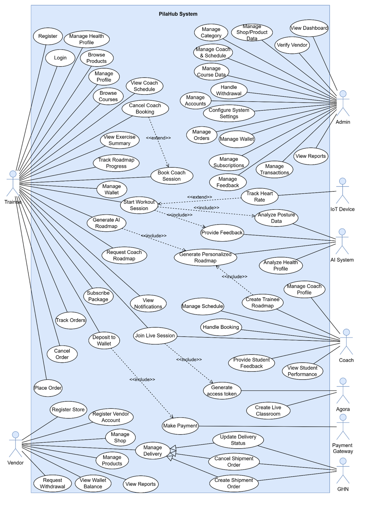
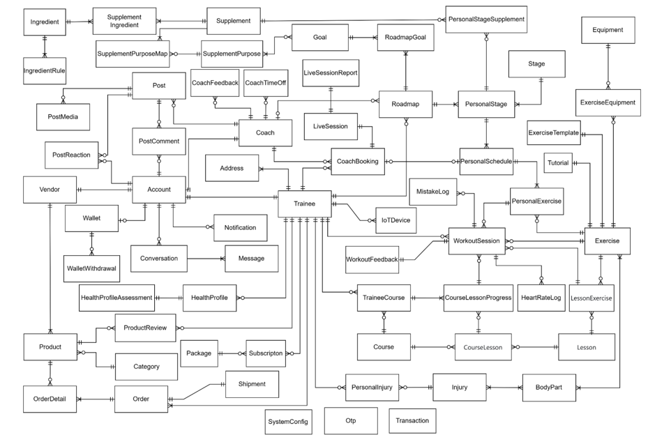

# PilaHub Core System

<p align="center">
	
</p>

<p align="center">
	
</p>

PilaHub là hệ sinh thái quản lý sức khỏe và fitness tập trung vào pilates, kết hợp theo dõi chỉ số cơ thể, phân tích tư thế bằng AI, đặt lịch tập, theo dõi tiến độ, thương mại điện tử và quản trị dịch vụ vận hành trong một nền tảng thống nhất.

## Giới Thiệu

PilaHub được xây dựng để gom các nhu cầu rời rạc của người tập Pilates vào một hệ sinh thái all-in-one:

- Người tập có thể theo dõi sức khỏe, nhận phản hồi tư thế bằng AI và quản lý lịch tập.
- Huấn luyện viên có thể theo dõi học viên, tinh chỉnh lộ trình và dạy trực tuyến 1-1.
- Admin và vendor có thể vận hành hệ thống, quản lý đơn hàng, sản phẩm và doanh thu.

## Tổng Quan Repository

Kho lưu trữ này chứa các thành phần chính của hệ thống PilaHub:

- `pilahub-backend`: backend API xử lý nghiệp vụ, người dùng, buổi tập, thanh toán và tích hợp AI.
- `pilahub-ai-system`: hệ thống AI hỗ trợ roadmap, scoring, workout feedback và các chức năng phân tích nội bộ.
- `pilahub-ai-model`: các mô hình AI dùng để nhận diện tư thế và suy luận lỗi động tác.

## Tính Năng Chính

- Quản lý hồ sơ sức khỏe và chỉ số cơ thể.
- Đánh giá tư thế luyện tập bằng AI và phản hồi theo body part cần chỉnh sửa.
- Quản lý lịch coach, đặt buổi tập và theo dõi live session.
- Hỗ trợ thanh toán, đơn hàng, ví và thông báo.
- Cung cấp dashboard, báo cáo và các luồng quản trị cho admin, coach, vendor và trainee.
- Hỗ trợ marketplace cho sản phẩm và dịch vụ liên quan đến Pilates.

## Tech Stack

- Backend: Java Spring Boot.
- Mobile: React Native.
- Web: Next.js.
- Database: PostgreSQL.
- Cloud & infra: Google Cloud Platform, NGINX.
- Tích hợp: Agora, Gemini File Search & LLM, VNPay / MoMo, GHN, Firebase Cloud Messaging.

## Kiến Trúc Hệ Thống

### Tổng quan triển khai

<p align="center">
	
</p>

Sơ đồ trên cho thấy luồng tương tác giữa mobile app, web app, backend Spring Boot, AI system nội bộ và các dịch vụ bên thứ ba như payment gateway, giao hàng và video/session services.

### Use case

<p align="center">
	
</p>

Sơ đồ use case mô tả đầy đủ các vai trò như trainee, coach, admin, vendor, IoT device, AI system, Agora, payment gateway và GHN trong toàn bộ quy trình vận hành.

### ERD dữ liệu

<p align="center">
	
</p>

ERD thể hiện các nhóm thực thể cốt lõi của hệ thống: tài khoản, sức khỏe, bài tập, session, coaching, wallet, order, shipment, notification, roadmap và các bảng phụ trợ liên quan.

## Cấu trúc Repository

```text
README.md
image-readme/
pilahub-ai-model/
pilahub-ai-system/
pilahub-backend/
```

## Tài Liệu Theo Từng Module

- [Backend README](pilahub-backend/README.md)
- [AI System README](pilahub-ai-system/README.md)
- [AI Model README](pilahub-ai-model/README.md)

## Đội Ngũ Phát Triển

Dự án Capstone (Mã: SP26SE004) - Đại học FPT TP.HCM.

- Trần Công Tường: Backend Business Logic, Database Design & Integration.
- Nguyễn Thanh Phong: Web/App Frontend Implementation & UI Testing.
- Nguyễn Cao Trí: System Architecture, Backend Core và Unit Testing.
- Nguyễn Văn Minh Thoại: Front-end.
- Nguyễn Thanh Mai: Front-end.
- Giảng viên hướng dẫn: ThS. Đỗ Tấn Nhàn.

## Ghi Chú

Repository này là bộ mã nguồn public cho PilaHub. Nếu bạn muốn mở rộng tài liệu, hãy bổ sung thêm README cho từng module, hướng dẫn cài đặt và sơ đồ triển khai chi tiết theo từng môi trường.

